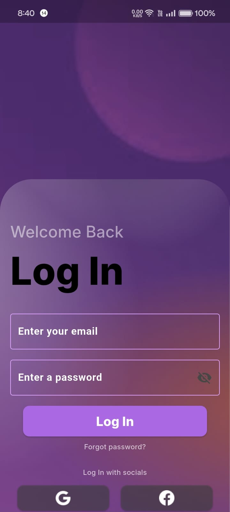

# SignovaX

**Empowering Converstations Beyond Words**

---

## 📢 Overview

SignovaX is an app designed to empower individuals with hearing and speech disabilities, offering them a platform to communicate easily and live independently. With features like live audio, text, and sign language translation, SignovaX bridges the gap between those with disabilities and the world around them. The app includes a chatbot that provides constant companionship, helping users never feel alone. The community feature connects people with shared interests, offering a space to communicate, share, and support one another. The app also features an SOS system, allowing users to send a preset message and share their location with emergency contacts by simply shaking their phone.

SignovaX empowers users to communicate, connect, and live with confidence, knowing they don’t have to rely on others to be heard or understood.

---

## 👥 Contributors

- [Disha Dwivedi](https://github.com/Dis1309)
- [Vanshika Malik](https://github.com/Vanshika-Malik2004)
- [Manroop Kaur](https://github.com/manroop04)
- [Jyothika P. Bojja](https://github.com/Jyothika-P)

---

## 📑 Table of Contents

- [Inspiration](#inspiration)
- [Understanding the Need](#understanding-the-need)
- [Goals of SignovaX](#goals-of-signovax)
- [Built With](#built-with)
- [Challenges We Faced](#challenges-we-faced)
- [Accomplishment](#accomplishment)
- [Impact](#impact)
- [What We Learned](#what-we-learned)
- [What’s Next](#whats-next)
- [Google Tech Used](#google-tech-used)

---

## 🌟 Inspiration

It all started with someone close to our team—one of our teammate’s relatives—who is both deaf and mute. Watching their daily struggle to communicate was heartbreaking. As we started looking for existing solutions, we realized most were paid, making them inaccessible to those who needed them the most. That’s when we knew we had to act. We envisioned a single platform that could empower deaf and mute individuals, giving them a space where they could connect, express, and navigate life more easily.

---

## 🧠 Understanding the Need

To understand the depth of the issue, we conducted research and came across alarming statistics from the WHO 2025 report:

- **70 million** people worldwide are deaf-mute

- **360 million** people worldwide are deaf, including 32 million children

WHO predicts that by 2050, 1 in 4 people will have hearing problems.

**Insights from Quora:**
We also turned to public platforms like Quora to listen, observe, and learn from real experiences shared by the deaf and mute community and their caregivers.

Beyond the numbers, we also reached out to individuals facing these challenges firsthand. Their stories and struggles shaped our vision, helping us design something truly impactful.

And that’s how SignovaX was born—a step towards an inclusive world where communication is a right, not a privilege.

---

## 🎯 Goals of SignovaX

### 1. Communicate Without a Mediator
**Short-term goal:** Help individuals communicate independently without always relying on others.  
**Long-term goal:** Integrate seamlessly into their daily lives, continuously improving the model’s functionality to enhance communication.

### 2. SOS System
**Short-term goal:** Enable an emergency contact system that automatically shares live location and a preset message, ensuring safety when stepping outside.  
**Long-term goal:** Reduce risks and contribute to lowering crime rates within the deaf and mute community.

### 3. Building a Supportive Community
**Short-term goal:** Create a safe space where users can openly share their feelings, connect with like-minded individuals.  
**Long-term goal:** Foster an engaged, long-lasting community that significantly reduces feelings of isolation.

### 4. Gemini Chatbot for Emotional Support
**Short-term goal:** Provide companionship and emotional support during moments of frustration or loneliness.  
**Long-term goal:** Help reduce stress and loneliness among people with disabilities, improving their overall well-being.

### 5. Accessibility & Inclusivity
**Short-term goal:** Ensure the app is user-friendly for all.  
**Long-term goal:** Expand global accessibility by supporting multiple sign languages and integrating with more assistive technologies.

---

## 🛠️ Built With

### 1. Mobile App (Flutter)
- Cross-platform framework ensures native performance.
- Manages UI, user interactions, and data collection.
- Seamlessly integrates with Firebase, ML models, and Google Maps API for real-time functionality.
- Allows users to create a customized avatar of their choice, adding a personal touch to the signing experience.

### 2. Firebase
- Real-time database for securely storing user data.
- Provides authentication and authorization for secure access and user management.

### 3. Vertex AI (Gemini API)
- AI-powered chatbot offering personalized emotional support.
- Helps individuals feel less isolated by providing companionship during tough times.

### 4. Google Maps API
- Ensures accurate location sharing for emergency SOS features.
- Provides real-time mapping and navigation support for users.

### 5. TensorFlow
- Used for sign language translation.
- Helps users who cannot read by converting text into sign language accurately.

### 6. Flask
- Backend framework used to build and deploy our sign-to-text model as a web API.
- Facilitates smooth communication between the mobile app and the gesture recognition model.

### 7. MediaPipe
- Used for real-time hand landmark detection in sign language gestures.
- Offers high accuracy and performance in detecting hand poses even in low-light conditions.

### 8. Convolutional Neural Networks (CNN)
- Core architecture used in training our gesture recognition model.
- Helps classify hand signs with high precision based on spatial features.

### 9. OpenCV
- Enables real-time image processing and video frame extraction for gesture analysis.
- Works alongside MediaPipe to improve hand detection and recognition efficiency.

### 10. Google Cloud Platform (GCP) Credits –

- Redeemed free trial credits for hosting and model training
- Enabled us to run Vertex AI, use cloud storage, and manage resources effectively

---

## 🚧 Challenges We Faced

### 1. Connecting with People
Before building the app, we knew that truly understanding the problem was crucial. However, finding and connecting with NGOs proved to be a significant challenge.

### 2. Sign Language Interpretation
Since we were not familiar with sign language symbols, we had to learn alphabets and common phrases to build and test the app effectively.

### 3. Dataset Challenges
- **Different Sign Languages:** There are multiple sign languages (ASL, ISL, etc.), and selecting the right dataset was crucial.
- **Lack of Text-to-Sign Data:** Very limited avatar-based datasets made implementation challenging.

### 4. Training Time & Computation
- **Huge Dataset:** Long training times and need for high computational power.
- **Uncertainty:** Model might not perform well even after hours of training.

### 5. Emotionally Sensitive Chatbot
- AI could sound cold/generic—fine-tuning prompts took time.
- Balancing empathy and helpfulness was critical.

Despite these challenges, every obstacle helped us refine our approach, making SignovaX a more impactful and reliable solution.

---

## 🏆 Accomplishment

Despite the many hurdles, our journey with SignovaX has been filled with meaningful wins that kept us going. Here are some of the accomplishments we’re proud of:
1. **Built an End-to-End Functional App**
 From design to deployment, we developed a fully functional app integrating live sign language translation, a chatbot, and a community space—all tailored for people with hearing and speech disabilities.

2. **Created a Working Sign-to-Text and Text-to-Sign Translator**
 We successfully implemented real-time translation between sign language and text/audio using TensorFlow, making communication easier and more accessible.

3. **Developed a Profile Recommendation System**
We added the feature to suggest relevant community members based on user hobbies, profession, and interests—bringing like-minded people together.

4. **Integrated an AI Companion for Mental Well-being**
 With the help of Gemini API, we built an emotional support chatbot that offers encouragement, companionship, and a sense of connection—especially during lonely moments.

5. **Designed a Unique SOS System**
 The emergency shake-to-alert feature allows users to instantly notify contacts and share their live location, boosting personal safety and independence.

6. **Reached Out to Real Users and NGOs**
 We connected with NGOs, community members, and individuals facing these challenges to collect feedback, validate our ideas, and ensure real-world applicability.

7. **Created a Scalable Architecture**
 The app is built in a way that allows us to easily add support for more sign languages, integrate additional assistive features, and scale to a global audience in the future.

---

## 🌍 Impact

With SignovaX, we didn’t just aim to build an app—we set out to build hope, connection, and independence for a community that is often overlooked.
1. **Empowered Communication**
 Users who previously relied heavily on others for everyday interactions now have the ability to express themselves independently through text, voice, and sign language.

2. **Emotional Support & Companionship**
 The AI-powered Gemini chatbot offers round-the-clock companionship, easing feelings of loneliness and isolation that many in the deaf and mute community silently battle.

3. **Safety First**
 With the shake-to-alert SOS feature, users feel safer and more confident when stepping out, knowing help is just a motion away.

4. **Bridging the Gap**
 Families and friends who don’t know sign language can now communicate more effectively, strengthening bonds and reducing the communication gap.

5. **Community Building**
 SignovaX fosters a community of shared experiences—where users not only feel seen and heard but also belong.

---

## 📚 What We Learned

> "The best way to learn is by doing—and sometimes, stumbling."

1. **Real-World Problem Solving Starts with Empathy**
 We learned that truly impactful solutions begin with understanding the emotions, struggles, and needs of real people. Talking to affected individuals and NGOs opened our eyes and guided our entire app design.

2. **Sign Language Is a Language of Its Own**
 While working on the translator, we realized sign language isn't just gestures—it's a full-fledged language with its own grammar and structure. Respecting that was crucial in our model development.

3. **Teamwork Is Important**
 From training heavy ML models to dealing with bugs during Firebase integration, we learned that dividing tasks, supporting each other, and staying calm helped us overcome every roadblock.

4. **Be Patient**
 Integrating AI taught us that results take time. Training, fine-tuning, and evaluating models is an iterative, patient process.

5. **Building for Impact Feels Different**
 This wasn’t just another app—it was a mission. Every small feature we built felt meaningful because we knew it had the potential to change lives.

**SignovaX taught us that innovation is not just about building something cool—it’s about building something that truly matters.**

---

## 🔮 What’s Next

Here are some of the innovations and enhancements we plan to bring in future versions:

1. **Smart Alerts (Flash/Vibration When Name is Called)**:
 Integrate sound recognition to detect when someone is calling the user's name and trigger a flash or vibration alert, ensuring users are always aware of their surroundings.

2. **YouTube API Integration for Learning:**
 Integrate with the YouTube API to recommend curated sign language tutorials and relevant videos based on user interests, making learning more accessible and personalized.

3. **Google Meet Integration:**
 Enable live sign language translation and transcription during Google Meet calls, so users can communicate smoothly in real-time video meetings, both in text-to-sign and sign-to-text formats.

4. **AI-Powered Daily Sentiment Tracker:**
 Use AI to understand the user’s emotional tone based on chatbot interactions and offer uplifting messages, music, or resources to support mental well-being.

5. **Multiple Sign Language Support:**
 Expand sign language translation to include other regional and international sign languages, increasing global accessibility.

---

 ## Preview of the Application
  
<h3 align="center">App Demo</h3>

  
  
  
  

---

  
  
  
  

---

  
  
  
  

---

## 🚀 Google Tech Used

> "Building the future with the power of **Google**."
   SignovaX was made possible by harnessing a wide range of powerful tools and platforms offered by Google. Each technology played a vital role in bringing our vision to life:

  

